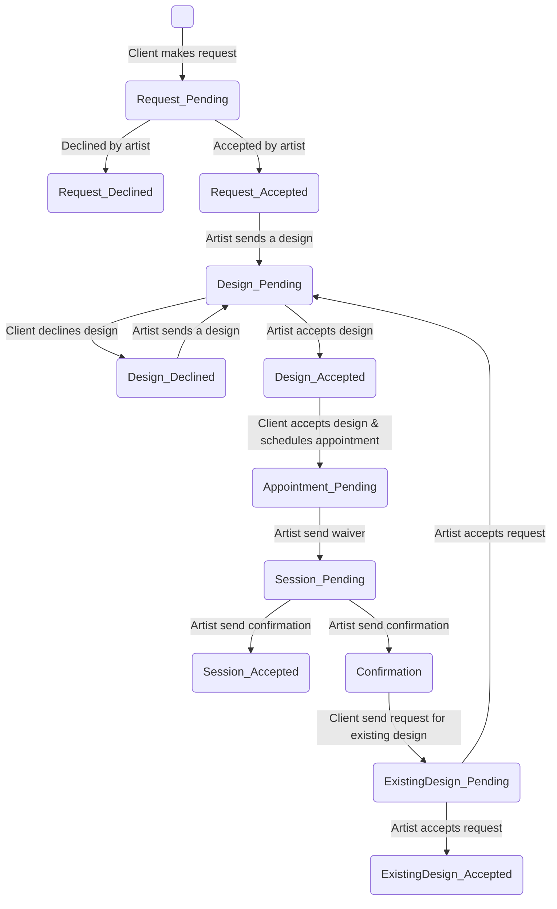

# Skinblu Booking

```mermaid
graph TD
0( ) --> |Client makes request| 1( Request_Pending ) 
  1 --> |Declined by artist| 2( Request_Declined )
  
  1 --> |Accepted by artist| 3( Request_Accepted )

3 --> |Artist sends a design| 4(Design_Pending)
  5 --> |Artist sends a design| 4
    4 --> |Client declines design| 5(Design_Declined)

    4 --> |Artist accepts design| 6(Design_Accepted)
      6  --> |Client accepts design & schedules appointment| 7(Appointment_Pending)
        7 --> |Artist send waiver| 8(Session_Pending)
          8 --> |Artist send confirmation| 9(Session_Accepted) & 10(Confirmation)
            10 --> |Client send request for existing design| 11(ExistingDesign_Pending)
              11 --> |Artist accepts request| 4 & 12(ExistingDesign_Accepted)
```
